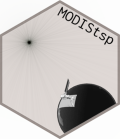

[](https://cran.r-project.org/package=MODIStsp)
[](https://cran.r-project.org/package=MODIStsp)
[](https://travis-ci.org/ropensci/MODIStsp)
[](https://doi.org/10.5281/zenodo.1972039)
[](https://codecov.io/github/ropensci/MODIStsp?branch=master)
[](https://github.com/ropensci/software-review/issues/184)

# MODIStsp 

[MODIStsp](https://docs.ropensci.org/MODIStsp/) is a “R” package devoted
to automatizing the creation of time series of rasters derived from
MODIS Land Products data. MODIStsp allows to perform several
preprocessing steps (e.g., download, mosaicing, reprojection and resize)
on MODIS data available within a given time period. Users have the
ability to select which specific layers of the original MODIS HDF files
they want to process. They also can select which additional Quality
Indicators should be extracted from the aggregated MODIS Quality
Assurance layers and, in the case of Surface Reflectance products, which
Spectral Indexes should be computed from the original reflectance bands.
For each output layer, outputs are saved as single-band raster files
corresponding to each available acquisition date. Virtual files allowing
access to the entire time series as a single file can be also created.
All processing parameters can be easily selected with a user-friendly
GUI, although non-interactive execution exploiting a previously created
Options File is possible. Stand-alone execution outside an “R”
environment is also possible, allowing to use scheduled execution of
MODIStsp to automatically update time series related to a MODIS product
and extent whenever a new image is available.

<a href="http://www.irea.cnr.it/en/">
</a>

***`MODIStsp` is developed and maintained by Lorenzo Busetto and Luigi
Ranghetti, [Institute of Remote Sensing of
Environment](http://www.irea.cnr.it/en/) - National Research Council -
Italy (CNR-IREA)***

## Citation

To cite `MODIStsp` please use:

L. Busetto, L. Ranghetti (2016) MODIStsp: An R package for automatic
preprocessing of MODIS Land Products time series, Computers &
Geosciences, Volume 97, Pages 40-48, ISSN 0098-3004,
<https://doi.org/10.1016/j.cageo.2016.08.020>, URL:
<https://github.com/ropensci/MODIStsp>.

## Website

For more information, documentation and examples of use, **see also the
MODIStsp website at
[docs.ropensci.org/MODIStsp](https://docs.ropensci.org/MODIStsp/)**

## Important News \!

  - 09/02/2020 - MODIStsp 2.0.0 is out. Provides a new GUI interface
    based on Shiny, getting rid of the archived dependencies on
    gWidgets/gWidgetsRGtk2. Also provides much easier usage from the
    CLI, by allowing to set all processing arguments also from the CLI.
    **NOTE** due to the introduced changes, options files created with
    previous versions of MODIStsp will no longer work. Also, processing
    scripts using MODIStsp may need to be slightly adapted\!

  - 09/05/2020 - MODIStsp 1.4.0 is out. Switches to use of GDAL3/PROJ6
    WKTs for projection representation and usage of `sf` for all
    internal work on vector data. Adds support for products MCD19A1 and
    MCD19A2 products.

  - 07/06/2019 - MODIStsp 1.3.9 is out. Fixes a bug causing crashes on
    MOD14A1 product, adds support for product MCD12Q2 and removes
    support for no longer available version 5 of some products.

  - 05/03/2019 - MODIStsp 1.3.8 is out. Fixes an issue causing incorrect
    application of scale/offset values on GDAL versions \> 2.3
    (<https://github.com/ropensci/MODIStsp/issues/163>) and adds support
    for products MOD21A1D.006 MOD21A1N.006 MOD21A2.006

  - 29/11/2018 - We recently discovered a nasty bug in the computation
    of some custom spectral indices (those including additions /
    subtractions on reflectance values, such as in (b1\_NIR+0.1) /
    b2\_Red. See
    [here](https://docs.ropensci.org/MODIStsp/articles/discovered_bug.html)
    for further details\! The bug is fixed as of version 1.3.7.

  - 07/08/2018 - We are glad to report that MODIStsp is now included in
    the [rOpenSci](https://ropensci.org/about/) packages’ ecosystem. We
    thank reviewers Leah Wasser and Jeffrey Hanson for their valuable
    reviews, which helped us to further improve the package\!

  - 10/07/2018 - MODIStsp v. 1.3.6 is out. Check out the [Release
    Notes](https://github.com/ropensci/MODIStsp/releases/tag/1.3.6) for
    further details \!

  - 20/06/2018 - MODIStsp v. 1.3.5 is out. Check out the [Release
    Notes](https://github.com/ropensci/MODIStsp/releases/tag/v1.3.5) for
    further details \!

  - 11/04/2018 - Due to new NASA Policies the MODIS FTP servers were
    shut down starting, April 2, 2018. **FTP download is therefore no
    longer working** and will be removed in the next MODIStsp version\!

  - 11/04/2018 - [**Decommissioning of MODIS Version 5 Land Data
    Products**](https://lpdaac.usgs.gov/news/decommissioning-modis-version-51-land-cover-type-data-products-january-7-2019/).
    As per NASA notice above, MODIS v005 products are going to be
    decommissioned, and will soon be no longer available for download.
    Support for those products will be removed in the next MODIStsp
    version\!.

  - 11/08/2017 - MODIStp 1.3.3 was released today. It provides
    improvements in processing speed, as well as the usual bug fixes
    (thanks to all the users that signaled problems \!). Check the
    [Release
    Notes](https://github.com/ropensci/MODIStsp/releases/tag/v1.3.3) for
    further details \!

  - 25/07/2017 - As of today, **most of the content related to MODIStsp
    has been moved to our new website at
    [docs.ropensci.org/MODIStsp](https://docs.ropensci.org/MODIStsp/)
    **, which provides a much better user interface and ease of access
    to MODIStsp-related information. From now on, please **consult the
    new website for detailed and updated information on the package**.

  - Also our previous FAQ page on github containing info for solving
    common installation, downloading and processing problems and issues
    was discontinued and **migrated at
    [docs.ropensci.org/MODIStsp/articles/faq.html](https://docs.ropensci.org/MODIStsp/articles/faq.html)**.

## Problems and Issues

  - Please **report any issues** you may encounter in our [issues page
    on github
    <i class="fa fa-github-square" aria-hidden="true"></i>](https://github.com/ropensci/MODIStsp/issues).

## <i class="fa fa-desktop" aria-hidden="true"></i> System Requirements

`MODIStsp` requires [R](https://cran.r-project.org) v \>= 3.6.3

-----

# Installation Instructions

## <i class="fa fa-windows" aria-hidden="true"></i> Installing on Windows

You can install the stable version of `MODIStsp` from CRAN:

`install.packages("MODIStsp")`

, or the development version (containing the latest improvements and bug
fixes) from github:

``` r
install.packages("remotes")
library(remotes)
install_github("ropensci/MODIStsp")
```

## <i class="fa fa-linux" aria-hidden="true"></i> Installing on Linux Systems

To install `MODIStsp` on Linux, you need to be able to install the `sf`
package, which requires several dependencies. See
[HERE](https://github.com/r-spatial/sf#installing) if you have trouble
installing `sf`.

Then, you can install the stable version of MODIStsp from CRAN:

``` r
install.packages("MODIStsp")
```

, or the development version (containing the latest improvements and bug
fixes) from github;

``` r
library(devtools)
install_github("ropensci/MODIStsp")
```

## <i class="fa fa-apple" aria-hidden="true"></i> Installing on Mac

To install `MODIStsp` on Linux, you need to be able to install the `sf`
package, which requires several dependencies. See
[HERE](https://github.com/r-spatial/sf#installing) if you have trouble
installing `sf`.

Then, you can install the stable version of MODIStsp from CRAN:

``` r
install.packages("MODIStsp")
```

, or the development version (containing the latest improvements and bug
fixes) from github;

``` r
library(devtools)
install_github("ropensci/MODIStsp")
```

# Usage

The easiest way to use `MODIStsp` is to use its powerful GUI (Graphical
User Interface) for selection of processing options, and then run the
processing.

To open the GUI, load the package and launch the MODIStsp function, with
no parameters:

``` r
library(MODIStsp)
MODIStsp()
```

This **opens a Shiny GUI** from which processing options can be
specified (and eventually saved or loaded). After specifying all
required parameters, clicking on “Start” will start the processing (see
[HERE](https://docs.ropensci.org/MODIStsp/articles/interactive_execution.html)
for more detailed instructions).

`MODIStsp` can also be launched in non-interactive mode within an `R`
session or script by setting the optional `GUI` parameter to FALSE, and
the `opts_file` parameter to the path of a previously saved JSON Options
file. This allows to exploit `MODIStsp` functionalities within generic
“R” processing scripts.

``` r
library(MODIStsp) 
# --> Specify the path to a valid options file saved in advance from MODIStsp GUI 
opts_file <- "X:/yourpath/youroptions.json" 
  
# --> Launch the processing
MODIStsp(gui = FALSE, opts_file = opts_file)
```

Finally, `MODIStsp` can be run by manually specifying all processing
arguments, or by overwriting some of the arguments contained in a saved
json file in the call to the package, such as in:

``` r
library(MODIStsp) 
# --> Specify the path to a valid options file saved in advance from MODIStsp GUI 
opts_file <- "X:/yourpath/youroptions.json" 
  
# --> Launch the processing
MODIStsp(gui        = FALSE, 
         opts_file  = opts_file, 
         start_date = "2020.05.01", 
         end_date   = "2020.08.01", 
         spatmeth   = "file", 
         spafile    = "X:/path_to/spatial_extent_file.gpkg")
```

, where we are overwriting the options related to spatial and temporal
extent contained in the options file with new values. This allows to
easily run processing based on the same main options (e.g., product
layers, output format, etc.) but changing on the fly the desired ones.

(see
[HERE](https://docs.ropensci.org/MODIStsp/articles/noninteractive_execution.html)
for more detailed instructions and examples).

# Code of Conduct

Please note that this project is released with a [Contributor Code of
Conduct](https://github.com/ropensci/MODIStsp/blob/master/CONDUCT.md).
By participating in this project you agree to abide by its terms.

[](https://ropensci.org)
