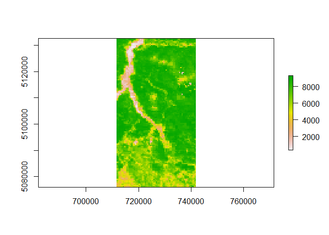
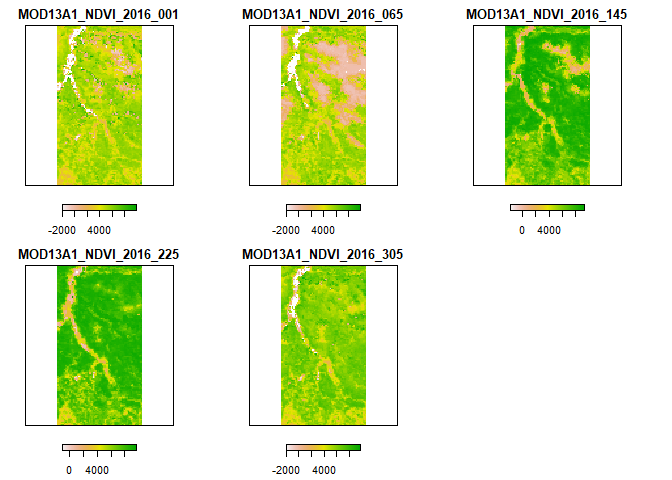
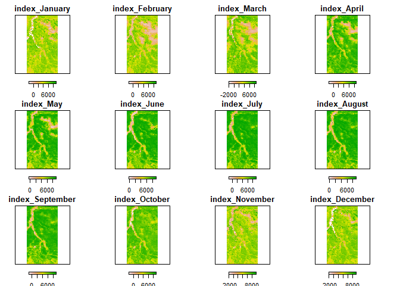
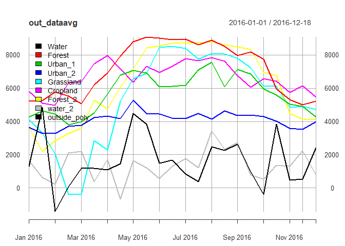
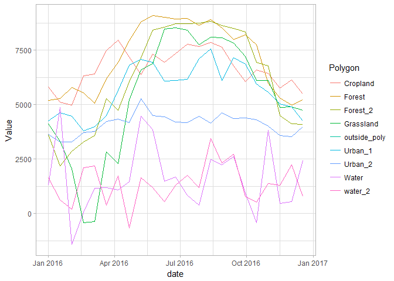
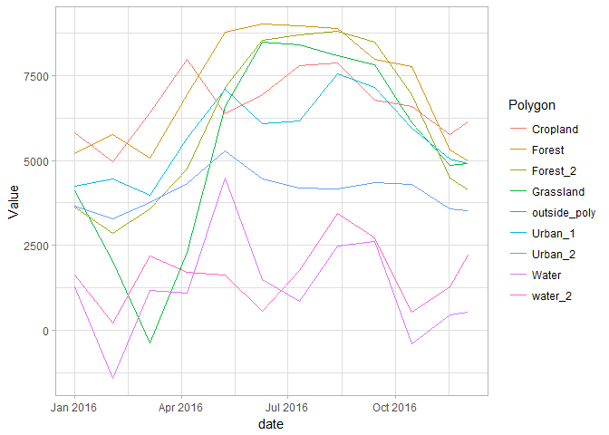

Accessing and Analyzing Processed Data from R
================

Accessing the processed time series from R
------------------------------------------

Preprocessed MODIS data can be retrieved within `R` either by accessing the single-date raster files, or by loading the saved `RasterStack` objects (see [HERE](articles/output.html) for a description of `MODIStsp` output folder structure and naming conventions).

To test this functionality, you can run the following example:

``` r
library(MODIStsp)
opts_file <- system.file("testdata/test_extract.json", package = "MODIStsp")
MODIStsp(options_file = opts_file, gui = TRUE)
```

, specifying a folder on your PC to store the outputs from the GUI.

This will download a yearly time series of MODIS NDVI data and subset it over the region of the Como Lake in Italy.

After the download and processing finishes (it will take a while), the MODIS time series will be placed in `youroutfolder/VI_16Days_500m_v6/`. (In this case, I have them in "`D:/Temp/VI_16Days_500m_v6/`").

Any single-date image can be accessed by simply opening it with a `raster` command:

``` r
modistsp_file <- "D:/Temp/VI_16Days_500m_v6/NDVI/MOD13A1_NDVI_2016_177.tif"
my_raster <- raster(modistsp_file)
plot(my_raster)
```



`RasterStack` (or GDAL vrt) time series containing all the processed data for a given parameter are saved in the "Time Series/RData" subfolder, and can be accessed by:

``` r
# Load the NDVI time series
ts_folder <- "D:/Temp/VI_16Days_500m_v6/Time_Series/"
in_virtual_file <- file.path(ts_folder, "RData/Terra/NDVI/MOD13A1_NDVI_1_2016_353_2016_RData.RData")
ts_data <- get(load(in_virtual_file))
ts_data
```

    ## class       : RasterStack 
    ## dimensions  : 122, 65, 7930, 23  (nrow, ncol, ncell, nlayers)
    ## resolution  : 463.3127, 463.3127  (x, y)
    ## extent      : 711648.3, 741763.7, 5076054, 5132578  (xmin, xmax, ymin, ymax)
    ## coord. ref. : +proj=sinu +lon_0=0 +x_0=0 +y_0=0 +a=6371007.181 +b=6371007.181 +units=m +no_defs 
    ## names       : MOD13A1_NDVI_2016_001, MOD13A1_NDVI_2016_017, MOD13A1_NDVI_2016_033, MOD13A1_NDVI_2016_049, MOD13A1_NDVI_2016_065, MOD13A1_NDVI_2016_081, MOD13A1_NDVI_2016_097, MOD13A1_NDVI_2016_113, MOD13A1_NDVI_2016_129, MOD13A1_NDVI_2016_145, MOD13A1_NDVI_2016_161, MOD13A1_NDVI_2016_177, MOD13A1_NDVI_2016_193, MOD13A1_NDVI_2016_209, MOD13A1_NDVI_2016_225, ... 
    ## time        : 2016-01-01 - 2016-12-18 (range)

, which gives us a 23-band `RasterStack` in the `ts_data` variable.

This `RasterStack` can be analyzed using the functionalities for raster/raster time series analysis, extraction and plotting provided for example by the `raster` or `rasterVis` packages:

``` r
# plot some dates
plot(ts_data[[c(1,5,10,15,20)]], axes = FALSE, horizontal = T)
```



``` r
# Extract one date from the stack

mydate   <- as.Date("2016-01-01")
substack <- subset(ts_data, which(getZ(ts_data) == mydate)) %>% setZ(mydate)
substack  
```

    ## class       : RasterLayer 
    ## dimensions  : 122, 65, 7930  (nrow, ncol, ncell)
    ## resolution  : 463.3127, 463.3127  (x, y)
    ## extent      : 711648.3, 741763.7, 5076054, 5132578  (xmin, xmax, ymin, ymax)
    ## coord. ref. : +proj=sinu +lon_0=0 +x_0=0 +y_0=0 +a=6371007.181 +b=6371007.181 +units=m +no_defs 
    ## data source : D:/Temp/VI_16Days_500m_v6/NDVI/MOD13A1_NDVI_2016_001.tif 
    ## names       : MOD13A1_NDVI_2016_001 
    ## time        : 2016-01-01

``` r
# Extract multiple dates from the stack

mindate   <- as.Date("2016-01-01")
maxdate   <- as.Date("2016-04-01")
substack  <- subset(ts_data, 
                    which(getZ(ts_data) >= mindate & getZ(ts_data) <= maxdate))
substack  
```

    ## class       : RasterStack 
    ## dimensions  : 122, 65, 7930, 6  (nrow, ncol, ncell, nlayers)
    ## resolution  : 463.3127, 463.3127  (x, y)
    ## extent      : 711648.3, 741763.7, 5076054, 5132578  (xmin, xmax, ymin, ymax)
    ## coord. ref. : +proj=sinu +lon_0=0 +x_0=0 +y_0=0 +a=6371007.181 +b=6371007.181 +units=m +no_defs 
    ## names       : MOD13A1_NDVI_2016_001, MOD13A1_NDVI_2016_017, MOD13A1_NDVI_2016_033, MOD13A1_NDVI_2016_049, MOD13A1_NDVI_2016_065, MOD13A1_NDVI_2016_081 
    ## time        : 2016-01-01, 2016-01-17, 2016-02-02, 2016-02-18, 2016-03-05, 2016-03-21

``` r
# Compute monthly averages

month_avg <- stackApply(ts_data, months(getZ(ts_data)), fun = mean)
month_avg
```

    ## class       : RasterBrick 
    ## dimensions  : 122, 65, 7930, 12  (nrow, ncol, ncell, nlayers)
    ## resolution  : 463.3127, 463.3127  (x, y)
    ## extent      : 711648.3, 741763.7, 5076054, 5132578  (xmin, xmax, ymin, ymax)
    ## coord. ref. : +proj=sinu +lon_0=0 +x_0=0 +y_0=0 +a=6371007.181 +b=6371007.181 +units=m +no_defs 
    ## data source : in memory
    ## names       : index_January, index_February, index_March, index_April, index_May, index_June, index_July, index_August, index_September, index_October, index_November, index_December 
    ## min values  :       -1891.0,        -1770.0,     -2000.0,     -1780.0,    -510.0,     -202.5,    -1347.0,       -275.0,         -1158.0,       -1944.0,        -2000.0,        -2000.0 
    ## max values  :        9130.0,         8888.0,      8577.0,      8699.5,    9231.5,     9284.5,     9229.5,       9110.5,          9187.0,        9173.0,         9824.0,         9352.5

``` r
plot(month_avg, axes = FALSE, horizontal = T)
```



------------------------------------------------------------------------

Extracting Time Series Data on Areas of Interest
------------------------------------------------

`MODIStsp` provides an efficient function (`MODIStsp_extract`) for extracting time series data at specific locations. The function takes as input a `RasterStack` virtual object created by `MODIStsp` (see above), the starting and ending dates for the extraction and a standard `sp` object (or an ESRI shapefile name) specifying the locations (points, lines or polygons) of interest, and provides as output a `xts` object or `data.frame` containing time series data for those locations.

If the input is of class *SpatialPoints*, the output object contains one column for each point specified, and one row for each date. If it is of class *SpatialPolygons* (or *SpatialLines*), it contains one column for each polygon (or each line), with values obtained applying the function specified as the "FUN" argument (e.g., mean, standard deviation, etc.) on pixels belonging to the polygon (or touched by the line), and one row for each date.

To test `MODIStsp_extract` we can start by loading the NDVI `RasterStack` time series created in the previous example:

``` r
ts_folder <- "D:/Temp/VI_16Days_500m_v6/Time_Series/"
in_virtual_file <- file.path(ts_folder, "RData/Terra/NDVI/MOD13A1_NDVI_1_2016_353_2016_RData.RData")
ts_data          <- get(load(in_virtual_file))
ts_data
```

    ## class       : RasterStack 
    ## dimensions  : 122, 65, 7930, 23  (nrow, ncol, ncell, nlayers)
    ## resolution  : 463.3127, 463.3127  (x, y)
    ## extent      : 711648.3, 741763.7, 5076054, 5132578  (xmin, xmax, ymin, ymax)
    ## coord. ref. : +proj=sinu +lon_0=0 +x_0=0 +y_0=0 +a=6371007.181 +b=6371007.181 +units=m +no_defs 
    ## names       : MOD13A1_NDVI_2016_001, MOD13A1_NDVI_2016_017, MOD13A1_NDVI_2016_033, MOD13A1_NDVI_2016_049, MOD13A1_NDVI_2016_065, MOD13A1_NDVI_2016_081, MOD13A1_NDVI_2016_097, MOD13A1_NDVI_2016_113, MOD13A1_NDVI_2016_129, MOD13A1_NDVI_2016_145, MOD13A1_NDVI_2016_161, MOD13A1_NDVI_2016_177, MOD13A1_NDVI_2016_193, MOD13A1_NDVI_2016_209, MOD13A1_NDVI_2016_225, ... 
    ## time        : 2016-01-01 - 2016-12-18 (range)

, which again gives us the 23-band `RasterStack` in the `ts_data` variable.

To extract the NDVI data over selected areas, we can then use the `MODIStsp_extract` function as follows:

``` r
# load a shapefile containing polygons --> Here we use a test shapefile in 
# the testdata folder of MODIStsp.

polygons <- rgdal::readOGR(system.file("testdata/extract_polys.shp",
                                       package = "MODIStsp"),
                           verbose = FALSE)
polygons
```

    ## class       : SpatialPolygonsDataFrame 
    ## features    : 10 
    ## extent      : 9.248174, 9.526815, 45.91182, 46.18547  (xmin, xmax, ymin, ymax)
    ## coord. ref. : +proj=longlat +datum=WGS84 +no_defs +ellps=WGS84 +towgs84=0,0,0 
    ## variables   : 2
    ## names       : id,  lc_type 
    ## min values  :  1, Cropland 
    ## max values  :  9,  water_2

``` r
# Now extract the average values for each polygon and date and plot the results

out_dataavg <- MODIStsp_extract(ts_data, polygons, id_field = "lc_type", 
                                small = FALSE)
head(out_dataavg)
```

    ##                Water   Forest Urban_1  Urban_2 Grassland Cropland Forest_2
    ## 2016-01-01  1286.000 5205.000    4249 3645.444 4118.6667 5810.769 3617.222
    ## 2016-01-17  4863.333 5264.333    4636 3279.889 3305.1667 5104.769 2183.111
    ## 2016-02-02 -1408.000 5773.667    4458 3276.111 2037.5000 4964.385 2849.444
    ## 2016-02-18    69.680 5532.667    3795 3705.333 -409.4000 6325.692 3286.222
    ## 2016-03-05  1176.000 5070.000    3972 3759.333 -374.6667 6402.231 3586.556
    ## 2016-03-21  1191.143 6197.333    4506 4226.889 2841.0000 7483.077 5281.000
    ##              water_2 outside_poly
    ## 2016-01-01 1637.2500           NA
    ## 2016-01-17  624.5714           NA
    ## 2016-02-02  207.5714           NA
    ## 2016-02-18 2113.1000           NA
    ## 2016-03-05 2195.0000           NA
    ## 2016-03-21  383.2857           NA

``` r
# Other summarization functions can be used, by specifying the "FUN" argument. 
# Compute the Standard Deviation over each polygon: 
out_datasd <- MODIStsp_extract(ts_data, polygons, id_field = "lc_type",
FUN = "sd", small = FALSE)
```

The output is a `xts` object, with one column for each polygon of the input shapefile, and one row for each date. We can easily plot the computed averages using:

``` r
library(xts)
plot(out_dataavg, legend.loc = "topleft")
```



We can also transform the output dataset to a long format and use `ggplot2` for plotting and other tidyverse-friendly functions for analysis:

``` r
library(ggplot2)
out_dataavg_df <- data.frame(date = index(out_dataavg), coredata(out_dataavg)) %>% 
  tidyr::gather(Polygon, Value, -date)

ggplot2::ggplot(out_dataavg_df, aes(x = date, y = Value, color = Polygon)) + 
  geom_line() + theme_light()
```



``` r
library(tibbletime)
library(dplyr)

# Compute monthly averages using tibbletime: 
 
out_dataavg_tt <- tibbletime::as_tbl_time(out_dataavg_df, index = date) 

month_avg <- out_dataavg_tt %>% 
  dplyr::group_by(Polygon) %>% 
  tibbletime::as_period(period = "monthly")

ggplot2::ggplot(month_avg, aes(x = date, y = Value, color = Polygon)) + 
  geom_line() + theme_light()
```



**IMPORTANT NOTES - 1** `MODIStsp_extract` is usually much faster than the standard `raster::extract` function, but does not deal with overlapping polygons. If your polygons are overlapping, please use `raster::extract` instead.

**IMPORTANT NOTES - 2** A more powerful extraction function can be also found in the `sprawl` package, currently under development on github (<https://lbusett.github.io/sprawl/>). In particular, `sprawl::extract_rast` deals much better with large rasters and long time series.
